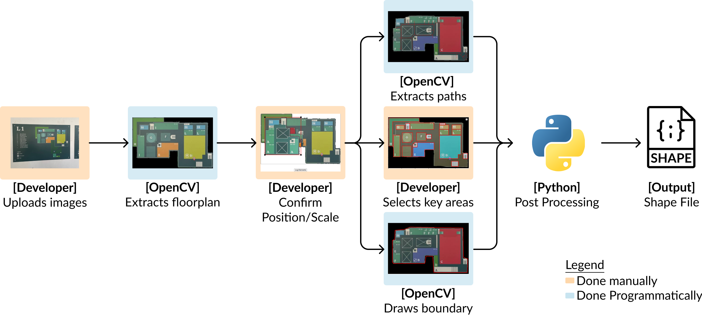

# Trash Matters Infrastructure (TMI) Shape File Formation

This is the Github Repository for Trash Matters Infrastructure (TMI), a flexible simulation platform for IoT based estate management system.

TMI is a collaboration between Design and Artificial (DAI) Students from the Singapore University of Technology and Design (SUTD) and Vidacity.

Project Report: insert link here

## Processing Pipeline for TMI


TMI is made out of 3 key components:
1. A internal development tool webapplication (syds_frontend)
2. Backend system to facilitate the internal development tool (syds_backend)
3. Python file used to process the output from the internal tool into a shape file (pythons)

## Internal Development Tool

### Initialisation, creating .env file
Before starting the internal development tool, you will need to create a .env file in the build folder. 
An **.env template** with the default ports has been provided, please create a .env file and duplicate the variables in the ,env template.

Once that has been done, run the following function in the terminal to start the internal development tool

```
cd build
docker compose up
```

Every component will automatically startup with their respective commands.

### Accessing the internal tool
To access the internal development tool of TMI, go to `http://localhost:${UI_SERVICE_PORT}` where ${UI_SERVICE_PORT} is the value in the .env file. The default port would be http://localhost:3000.

## File Structure
```
├── build                   <- Folder with docker files for both the frontend and backend
│
├── pythons                 <- Folder with postprocessing functions and outputs
│   ├── shapes              <- Folder with python function used for postprocessing
│   ├── utils               <- Folder with python helper functions used for postprocessing
│   ├── data.json           <- json folder with output from the internal tool which will be postprocessed
│   └── formingNumpy.ipynb  <- python notebook with the code to postprocess the output from the internal tool
│
├── syds_backend            <- Backend for the internal tool
│
└── syds_frontend           <- Frontend for the internal tool
```